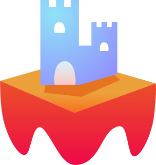

# LavaMoat

**NOTE: under rapid develop, not ready for production use, has not been audited, etc**

  **LavaMoat** is a set of tools for securing JavaScript projects against a category of hacks called **software supply chain attacks.**

  This genre of attack occurs when a malicious dependency makes it way into a developer's application. An attacker could use the vulerable dependency to then steal important secrets like credit card numbers, private keys, or personal data.

  These attacks have already hit the cryptocurrency ecosystem and present a significant risk for the developers and users of wallets and apps.

  In order to help mitigate the risk of such an attack we are building a suite of tools that range from plugins for common app bundlers (eg webpack, browserify) to dependecy analysis and visualization tools.

  **The goal of LavaMoat** is to bring added protections to modern JavaScript apps without having to rewrite them from scratch and automate a good first-start security configuration.

## [Watch the introduction video](https://www.youtube.com/watch?v=pOTEJy_FqIA)

### How it works

The LavaMoat runtime reduces the supplychain risk in **three** primary ways:
  1. Prevent modifying JavaScript's primordials (Object, String, Number, Array, ...)
  2. Limit access to the platform API (window, document, XHR, etc) per-package
  3. Prevent packages from corrupting other packages

1 and 2 are provided by [SES][SesGithub] containers. Platform API access is passed in via a LavaMoat configuration file.

3 is achieved by providing a unique mutable copy of the imported module's exports. Mutating the module's copy of the exports does not affect other modules.

### SecureEcmaScript (SES)

[SES][SesGithub] is the sandbox used in LavaMoat. See SES's [secure computing guide](https://github.com/Agoric/SES/blob/master/docs/secure-coding-guide.md) to learn more about the risks of untrusted javascript.

### LavaMoat in the browser

When using LavaMoat in the browser, you can just use your favorite bundler if there is an available plugin.

App bundles have **two** major components:

1. Runtime (aka kernel / loader / prelude / trusted computing base)
This is the code that initializes and runs the bundle. For example, the implementation of the `require` function.

2. Module sources
This includes the js content of the module sources, and sometimes some config information like module name alaises.

LavaMoat modifies the bundle's runtime to enforce the configured constraints.

### Bundler Plugins:
  - [LavaMoat Webpack](./packages/webpack)
  - [LavaMoat Browserify](./packages/browserify)

### LavaMoat in Node.js

Coming soon!

### Additional tools

In addition to the LavaMoat runtime bundler plugins, there are some tools to help analyze your dependecy graph and configuration.

See [lavamoat-viz](https://github.com/LavaMoat/sesify-viz) for a demo of the tool.

### Further reading on software supplychain security

#### Articles:
- [HackerNoon - I’m harvesting credit card numbers and passwords from your site. Here’s how](https://medium.com/hackernoon/im-harvesting-credit-card-numbers-and-passwords-from-your-site-here-s-how-9a8cb347c5b5)
- [Agoric - POLA Would Have Prevented the Event-Stream Incident](https://medium.com/agoric/pola-would-have-prevented-the-event-stream-incident-45653ecbda99)
- [Snyk - Why npm lockfiles can be a security blindspot for injecting malicious modules](https://snyk.io/blog/why-npm-lockfiles-can-be-a-security-blindspot-for-injecting-malicious-modules/)
- [Bytecode Alliance - Building a secure by default, composable future for WebAssembly](https://bytecodealliance.org/articles/announcing-the-bytecode-alliance)

#### Videos:
- [JavaScript Supply Chain Security - Adam Baldwin - LocoMocoSec 2019 ~25min](https://www.youtube.com/watch?v=HDo2iOlkbyc)
- [Analysis of an exploited npm package – Jarrod Overson - Amsterdam JSNation Conference 2019  ~25min](https://www.youtube.com/watch?v=cvtt8TexqbU)

### Supporters

Made with love by [MetaMask](https://github.com/metamask/)

Funded by [ConsenSys](https://github.com/consensys)

Runs on [Agoric](https://github.com/agoric/)

[SesGithub]: https://github.com/agoric/SES
