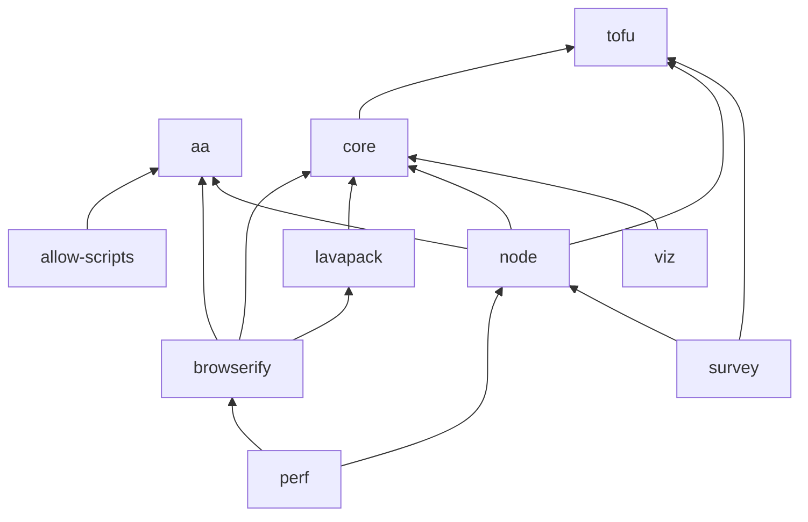

# Semantic Release Workflow

LavaMoat follows [Semantic Versioning 2.0.0](https://semver.org/spec/v2.0.0.html).
This lays out part of the steps involved in drafting and publishing any of the LavaMoat packages monotonically.

## 0. Prerequirements

- One package per release
- Releases are always monotonically from current `main`.
- Ensure your local `main` branch is up to date
- Perform any necessary manual or local tests not covered in automatic tests
- Review the commits since the last release: `$ git log main...$(git log --grep "${PKGDIR}/version - ${CURRENT_VERSION}" --format=tformat:%h) packages/${PKGDIR}`
- Review the diff since the last release: `$ git diff main $(git log --grep "${PKGDIR}/version - ${CURRENT_VERSION}" --format=tformat:%h) packages/${PKGDIR}`
- Determine the new version number based on the nature of changes
  - Follow up with author or reviewers if the SemVer-nature of an included change is unclear before proceeding

## 1. Preparing your release

1) Bumping version
  - Create a new branch: `git checkout -b release-${PKGDIR}-${VERSION}`
  - Bump the `version` field in `packages/{PKGDIR}/package.json` in an individual commit
    - Commit title must be of format `${PKGDIR}/version - ${VERSION}`
    - Commit body must contain an exhaustive list of changes to the package since last release (commit hashes and/or merged PR numbers).
  - Build, lint, and test the package
2) Bumping dependents
  - Identify any other packages in the monorepo that depend on the current version of this package and should have their versions bumped
    - Useful: `$ find packages -maxdepth 2 -name package.json -exec jq '[.name, .dependencies["PKGNAME"], .devDependencies["PKGNAME"]] | select(.[1] or .[2])|@tsv' {} -r \;`
  - Perform updates of dependents if necessary in additional commit
  - Build, lint, and test any updated dependants
    - Keep in mind that as long as the version range of the dependency is satisfied by the locally checked out package, internal dependencies will be linked to that. Otherwise, it's fetched from the configured registry like any other dependency.
3) Review
  - Build, lint, and test the workspace
  - `git diff release-${PKGDIR}-${VERSION} main` should only contain version and dependency bumps in `package.json` files, and the corresponding changes in `yarn.lock`

## 2. Submitting a release PR

Open a new [pull request](https://github.com/LavaMoat/LavaMoat/compare) from your branch targeting `main`.

The PR description should contain an exhaustive list of included changes - usually you can just copy the commit message verbatim.

If there are particularities reviewers should be aware of (urgency, manual testing steps), that should be mentioned in the description or in comments to the PR.

Request review from the LavaMoat/devs team. Await approval.

## 3. Publish to npmjs.com

This part can be done by a different person.

0. Prerequisites
  - PR reviewed
  - Credentials to a user on npmjs.org with publish permissions to the relevant package
  - Push permissions to https://github.com/LavaMoat/LavaMoat `main` branch
  - Ensure you are doing this from a secure environment and handle the npm credentials with utmost care
    - In particular, keep deployment and development/testing systems separate
  - Fresh clone to ensure a clean and consistent state
1. `$ git checkout main && cd ${WORKSPACE_ROOT}`
2. `$ git merge --ff-only release-${PKGDIR}-${VERSION}`
3. Install and build workspace
  - `$ NODE_ENV=production yarn --frozen-lockfile --check-files --production=false`
  - `$ NODE_ENV=production yarn setup`
  - `$ NODE_ENV=production yarn build`
4. `$ yarn test:prep && yarn test`
5. `$ git push origin main`
6. Authenticate as your user on npmjs.org:
  - `$ npm login`
  - `$ npm whoami` should now return your npmjs.org username
7. `$ yarn run publish`
8. Close down environment and ensure npm token is no longer present

---

# Release dependency

*when releasing, go top-down*

| folder | npm name | deps |
|---|---|---|
| aa | @lavamoat/aa |  |
| allow-scripts | @lavamoat/allow-scripts |  @lavamoat/aa |
| browserify | lavamoat-browserify |  @lavamoat/aa, @lavamoat/lavapack, lavamoat-core |
| core | lavamoat-core |  lavamoat-tofu |
| lavapack | @lavamoat/lavapack |  lavamoat-core |
| node | lavamoat |  @lavamoat/aa, lavamoat-core, lavamoat-tofu |
| perf | lavamoat-perf |  lavamoat-browserify, lavamoat |
| preinstall-always-fail | @lavamoat/preinstall-always-fail | |
| survey | survey |  lavamoat, lavamoat-tofu |
| tofu | lavamoat-tofu |  |
| viz | lavamoat-viz |  lavamoat-core |
| yarn-plugin-allow-scripts | @lavamoat/yarn-plugin-allow-scripts |  |
