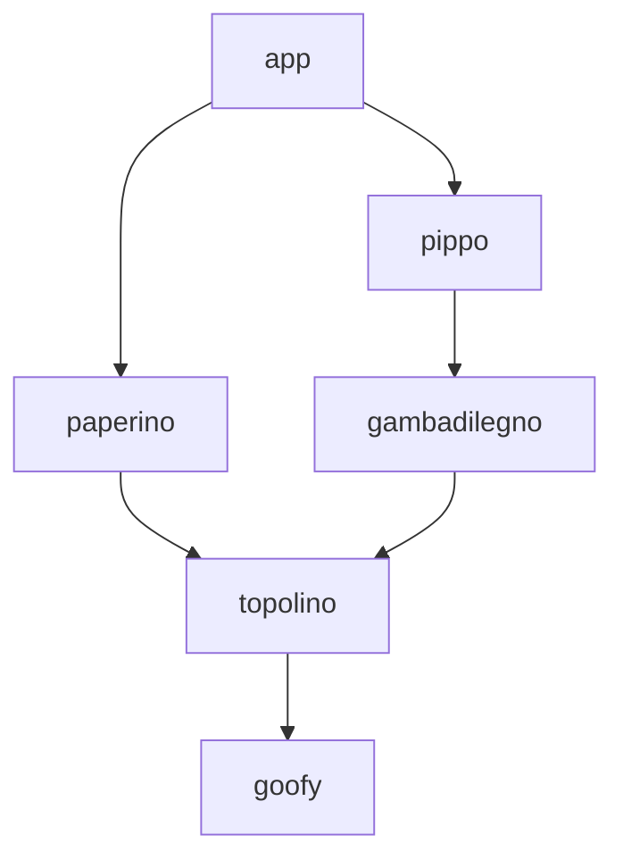

This fixture contains a configuration that has two different paths from the root app (`app`) to the same module (`goofy`). The paths are of the same length, but one if them is shorter in terms of character count. Thus, `app>paperino>topolino>goofy` should be considered the shortest path to `goofy`, and the `path` of `goofy`'s `CompartmentDescriptor` will reflect that (omittingt t).

Diagram of the module graph:

