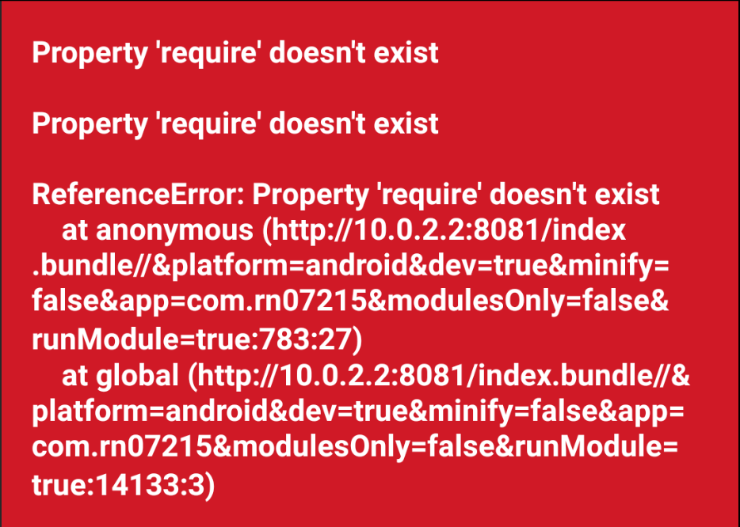
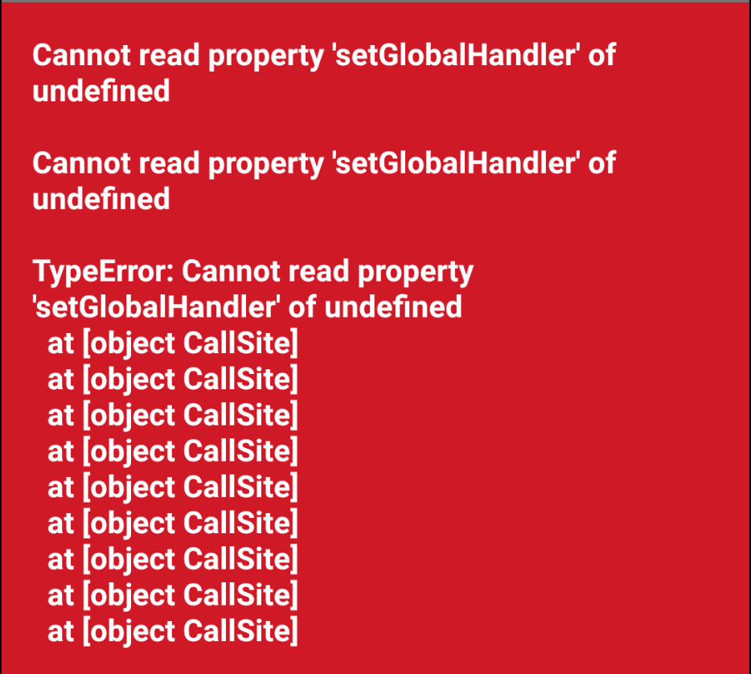

# Troubleshooting

> [!IMPORTANT]
>
> Always execute `react-native start --reset-cache` or `react-native bundle --reset-cache` after Babel or Metro config changes to remove cached files.
>
> This will ensure a fresh build/bundle with your configuration changes, rather than relying on hot-reload or hot/cold starts.

## `ReferenceError: Property 'require' doesn't exist`



Upon inspecting the bundle, the reference error is throwing early when evaluating the SES shim.

It is clear Babel is preparing it to be [transformed][ses-transformed-ext]:

```js
// http://localhost:8081/index.bundle//&platform=android
// ...
(function (global) {
  var _asyncToGenerator = require("@babel/runtime/helpers/asyncToGenerator");
  var _toArray = require("@babel/runtime/helpers/toArray");
  var _objectWithoutProperties = require("@babel/runtime/helpers/objectWithoutProperties");
  var _toConsumableArray = require("@babel/runtime/helpers/toConsumableArray");
  var _slicedToArray = require("@babel/runtime/helpers/slicedToArray");
  var _defineProperty = require("@babel/runtime/helpers/defineProperty");
  var _objectDestructuringEmpty = require("@babel/runtime/helpers/objectDestructuringEmpty");
  var _excluded = ["name", "message", "errors", "cause", "stack"],
    _excluded2 = ["random"],
    _excluded3 = ["__options__"],
    _excluded4 = ["errorTaming", "errorTrapping", "reporting", "unhandledRejectionTrapping", "regExpTaming", "localeTaming", "consoleTaming", "overrideTaming", "stackFiltering", "domainTaming", "evalTaming", "overrideDebug", "legacyRegeneratorRuntimeTaming", "__hardenTaming__", "dateTaming", "mathTaming"];
  function _defineAccessor(e, r, n, t) { var c = { configurable: !0, enumerable: !0 }; return c[e] = t, Object.defineProperty(r, n, c); }
  // ses@1.13.0
  (function (functors) {
// ...
```

Assert Babel is configured to ignore your flavour(s) of SES shim (see the [ReadMe Babel config][readme-babel-config]) examples, then re-run React Native CLI with the `--reset-cache` flag.

Now it should look much cleaner:

```js
// http://localhost:8081/index.bundle//&platform=android
// ...
(function (global) {
  // ses@1.13.0
  (functors => options => {
// ...
```

## `Cannot read property 'setGlobalHandler' of undefined`



It looks like React Native is having trouble [initializing][init-core-ext] when setting up [error handling][set-up-error-handling-ext], due to the missing [error guard][rn-js-polyfills-error-guard-ext] polyfill.

Did you remember to include the React Native JS polyfills in your custom Metro config? See the [ReadMe Metro Existing config][readme-metro-config] example.

## License

Copyright © 2025 Consensys, Inc. Licensed MIT

[init-core-ext]: https://github.com/facebook/react-native/blob/main/packages/react-native/Libraries/Core/InitializeCore.js
[readme-babel-config]: README.md#babel-config
[readme-metro-config]: README.md#existing-config
[rn-js-polyfills-error-guard-ext]: https://github.com/facebook/react-native/blob/c50f3e5f668887bfb0c7080155c066a4fdcc092c/packages/polyfills/error-guard.js#L38-L40
[ses-transformed-ext]: https://github.com/endojs/endo/issues/662
[set-up-error-handling-ext]: https://github.com/facebook/react-native/blob/c50f3e5f668887bfb0c7080155c066a4fdcc092c/packages/react-native/Libraries/Core/setUpErrorHandling.js#L33
