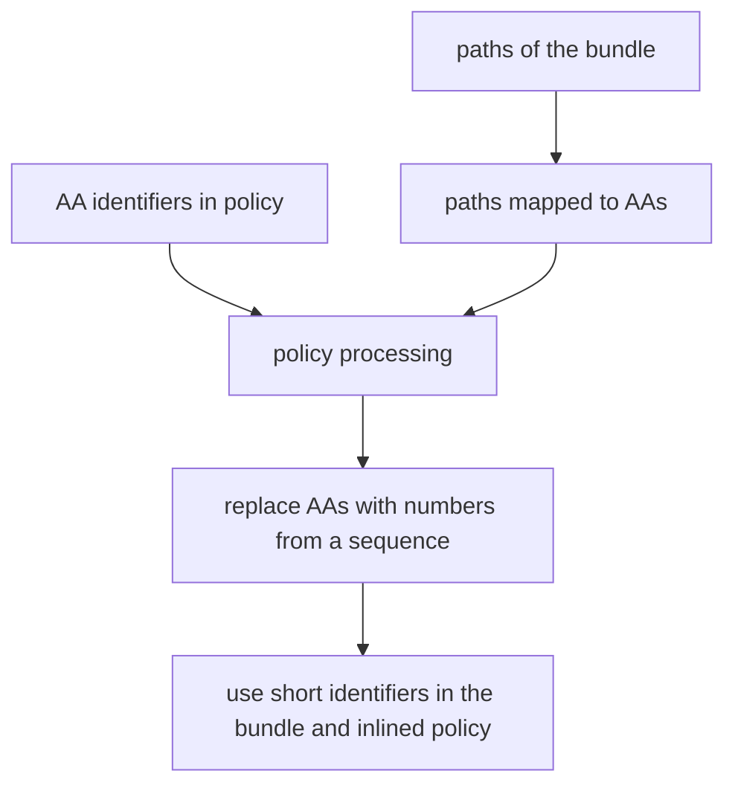

# ScorchWrap PoC

> It's like stretchwrap, but with lava

ScorchWrap is a webpack plugin that wraps each module in the bundle in a container and enforces LavaMoat Policies per package.

Implemented capabilities:

 - [x] wrapping built module sources 
 - [x] runtime to make wrapped modules work
 - [x] turn off concatenateModules and warn it's incompatible
 - [x] inlining runtime into the bundle
 - [x] including actual policies
 - [ ] using policies to control module loading at runtime
 - [ ] using policies to limit globals at runtime
 - [ ] researching and covering all `__webpack_require__.*` functions for security as needed 
 - [ ] support dynamic imports/requires reaching beyond the bundled content
 - [ ] paranoid mode checks
 - [ ] research potential concatenateModules support
 - [ ] ecosystem compatibility quirks we're yet to find

*(for more specific issues to solve see TODO comments in code)*


## Usage

The ScorchWrap plugin takes an optional options object with the following properties:

- runChecks: Optional boolean property to indicate whether to check resulting code with wrapping for correctness. Default is false.
- diagnosticsVerbosity: Optional number property to represent diagnostics output verbosity. A larger number means more overwhelming diagnostics output. Default is 0.  
  Setting positive verbosity will enable runChecks.

```js
const ScorchWrapPlugin = require('@lavamoat/scorchwrap');

module.exports = {
  // ... other webpack configuration properties
  plugins: [
    new ScorchWrapPlugin({
      policy: { ... LavaMoat policy structure ... }
      runChecks: true,
    //   diagnosticsVerbosity: 2,
    }),
  ],
  // ... other webpack configuration properties
};
```

One important thing to note when using the ScorchWrap plugin is that it disables the `concatenateModules` optimization in webpack. This is because concatenation won't work with wrapped modules.

### Gotchas

- Webpack will gladly add missing dependencies for node builtins like the `events` or `buffer` packages. For LavaMoat policy to handle it, the package needs to be explicitly listed in prod dependencies.

# Security Claims

- SES must be added to the page without any bundling or transforming for any security guarantees to be sustained.
- Each javascript module resulting from the webpack build is scoped to its package's policy

Threat model

- webpack itself is considered trusted
- all plugins can bypass LavaMoat protections intentionally
- It's unlikely but possible that a plugin can bypass LavaMoat protections unintentionally
- It should not be possible for loaders to bypass LavaMoat protections
- Some plugins (eg. MiniCssExtractPlugin) execute code from the bundle at build time. To make the plugin work you need to trust it and the modules it runs and add the ScorchWrap.ignore loader for them.
# Development

## Control flow

A diagram of the chronological relationships between various hooks would still be complex and easily outdated, so we've opted to explicitly define intermediate states and use the state machine throughout to make following what's going on easier. See `stateMachine()` in plugin.js

### package identifiers

We use @lavamoat/aa to identify packages for the policy. 
As part of this plugin we'll need to identify modules in a compatible way and then work the policy into the bundle runtime.  
At that point, when everything i bundled, there's no point in maintaining full identifiers, so they can be replaced with numbers to occupy less space.



#### Ignored modules
Webpack generates this:
```
const nodeCrypto = __webpack_require__(/*! crypto */ "?0b7d");
```
when a module is ignored (Node builtins are a good example of that. If you want a builtin to work, you sometimes need to supply a package for it as a dependency yourself)
A carveout is necessary in policy enforcement for these modules. 
Sadly, even treeshaking doesn't eliminate that module. It's left there and failing to work when reached by runtime control flow.

## Manual testing

run `yarn` and `yarn lib:ses` in the packages/scorchwrap folder before you begin

`cd app`  
run `npm ci`  
run `npm test` to trigger the build  
open dist/index.html in the browser and look at the console

## Testing TODO

List of what to cover ordered by priority

- [ ] e2e test creating a bundle and run it to check for errors
- [ ] cover all module types
- [ ] configure bundle splitting
- [ ] cover all types of runtimeRequirements with examples (stuff passed to closures along with modue and exports and `__webpack_require__`, also all the methods on `__webpack_require__`)
- [ ] cover webpack magic comments

## Features

### policy

There's two ways we could handle policy
1. inline into each module at compilation time 
   We're working per-module, so this would produce a lot of duplication but eliminate the need to store entire policy with keys for each package.
2. add to runtime, keyed  
   For now holding on to the entire policy seems like a better idea, we could compress the keys at compile time easily.
   
Current implementation inlines the policy as-is into the bundle.

### package identification
If we run a'a' on the dependencies, we're going to need means to look them up by path. It'd be nice to collect the paths first and only create IDs based on the paths included in the bundle instead of going through entire node_modules. We could collect the IDs on an earlier phase, before generate, to create a mapping from paths to IDs only for the packages involved. 

After a mapping is built, the actual values of identifiers are no longer important, for bundling policy into the runtime and wrapping packages they just need to match, so it makes sense to replace them with random values before they're rendered into the bundle.


### modes

- default 
- paranoid - adds extra checks

Things it could check in paranoid mode
- use other hooks to check if the number of bundle entries equals the number of entries processed by the wrapper
- add a local reference before the with blocks and a function within to look it up and alert if it can be found - should trigger if a transform or plugin action breaks the withproxies. This would be best implemented by the plugin injecting a tiny module with the source to do this.
- allow optionally importing a canary package that tries to escape (kinda overlaps with above, but could use more methods)
- run an AST on the final bundle to identify the scopes without the `with` blocks (after all minitication etc.)
