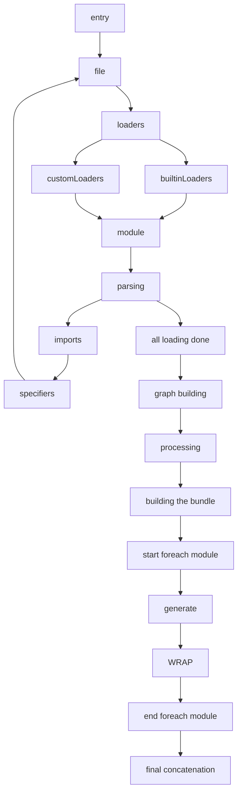

sources as text at different stages:
- file text
- module source
- result of generate(module)
- bundle

```mermaid
flowchart TD;

entry-->file-->loaders
loaders-->builtinLoaders
loaders-->customLoaders
builtinLoaders-->module
customLoaders-->module
module-->parsing
parsing-->imports-->specifiers-->file
parsing-->a[all loading done]-->g[graph building]-->processing-->b[building the bundle]-->gen[start foreach module]-->generate-->WRAP-->gen2[end foreach module]-->con[final concatenation]


```

