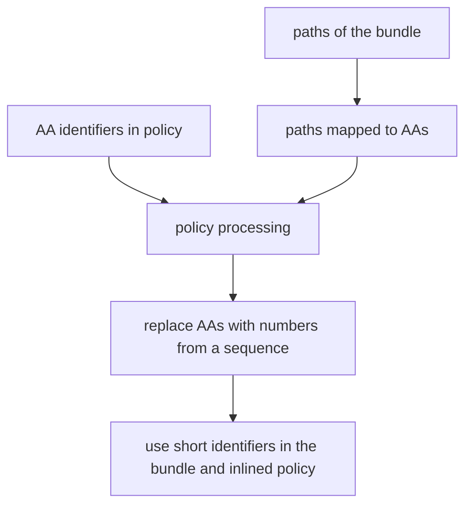

# Development

> Notes and plans for further development

Implemented capabilities:

- [x] wrapping built module sources
- [x] runtime to make wrapped modules work
- [x] turn off concatenateModules and warn it's incompatible
- [x] inlining runtime into the bundle
- [x] including actual policies
- [x] using identifiers matching the policy
- [x] using policies to control module loading at runtime
- [x] using policies to limit globals at runtime
- [x] adding lockdown.js from ses to dist
- [ ] support for "write" value in globals policy
- [ ] researching and covering all `__webpack_require__.*` functions for security as needed
- [ ] support dynamic imports/requires reaching beyond the bundled content
- [ ] paranoid mode checks
- [ ] policy generation built into the plugin
- [ ] research potential concatenateModules support
- [ ] ecosystem compatibility quirks we're yet to find

## Control flow

To better understand the control flow of the plugin, observe the `PROGRESS` tool and how it indicates the sequence of steps happening in the plugin.
`PROGRESS` logs various diagnostic information on levels 1 and 3

NOTE: A setup might exist where some steps get revisited with multiple chunks or entries. The progress tool will complain even if plugin still works in such case. We'll have to adjust when we get there.

## Testing improvements

https://github.com/webpack/webpack/tree/main/examples contains potentially all unique things webpack supports. We should pick examples to cover from there.

List of what to cover ordered by priority

- [x] e2e test creating a bundle and run it to check for errors
- [x] e2e test covering basic security claims
- [ ] cover all module types
- [ ] configure bundle splitting
- [ ] cover all types of runtimeRequirements with examples (stuff passed to closures along with modue and exports and `__webpack_require__`, also all the methods on `__webpack_require__`)
- [ ] cover webpack magic comments

### package identifiers

We use @lavamoat/aa to identify packages for the policy.
As part of this plugin we'll need to identify modules in a compatible way and then work the policy into the bundle runtime.  
At that point, when everything i bundled, there's no point in maintaining full identifiers, so they can be replaced with numbers to occupy less space.

# Features

### policy

There's two ways we could handle policy

1. inline into each module at compilation time
   We're working per-module, so this would produce a lot of duplication but eliminate the need to store entire policy with keys for each package.
2. add to runtime, keyed  
   For now holding on to the entire policy seems like a better idea, we could compress the keys at compile time easily.

Current implementation inlines the entire policy into the bundle once (option 2).

### package identification

If we run a'a' on the dependencies, we're going to need means to look them up by path. It'd be nice to collect the paths first and only create IDs based on the paths included in the bundle instead of going through entire node_modules. We could collect the IDs on an earlier phase, before generate, to create a mapping from paths to IDs only for the packages involved.

After a mapping is built, the actual values of identifiers are no longer important, for bundling policy into the runtime and wrapping packages they just need to match, so it makes sense to replace them with random values before they're rendered into the bundle.

### modes

- default
- paranoid - adds extra checks (not implemented)

Things it could check in paranoid mode

- use other hooks to check if the number of bundle entries equals the number of entries processed by the wrapper
- add a local reference before the with blocks and a function within to look it up and alert if it can be found - should trigger if a transform or plugin action breaks the withproxies. This would be best implemented by the plugin injecting a tiny module with the source to do this.
- allow optionally importing a canary package that tries to escape (kinda overlaps with above, but could use more methods)
- run an AST on the final bundle to identify the scopes without the `with` blocks (after all minitication etc.)
