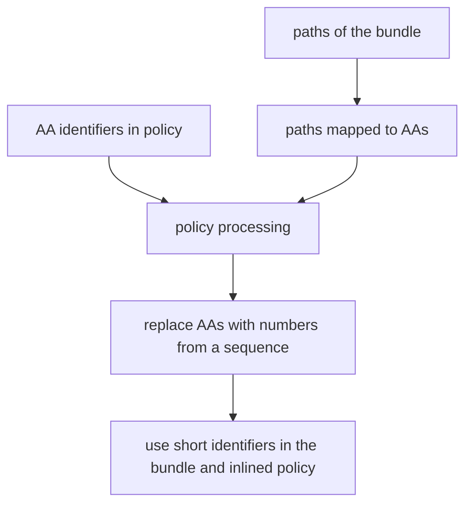

# LavaMoat Webpack Plugin

> Putting lava in your pack. For security. We need to work on our metaphors.

LavaMoat Webpack Plugin wraps each module in the bundle in a [Compartment](https://github.com/endojs/endo/tree/master/packages/ses#compartment) and enforces LavaMoat Policies independently per package.


## Usage

The LavaMoat plugin takes an options object with the following properties:

- policy: the LavaMoat policy object. (unstable. This will surely change before v1 or a policy loader export will be provided from the main package to incorporate policy-override files)
- runChecks: Optional boolean property to indicate whether to check resulting code with wrapping for correctness. Default is false.
- diagnosticsVerbosity: Optional number property to represent diagnostics output verbosity. A larger number means more overwhelming diagnostics output. Default is 0.  
  Setting positive verbosity will enable runChecks.
- readableResourceIds: Decide whether to keep resource IDs human readable (regardless of production/development mode). If false, they are replaced with a sequence of numbers. Keeping them readable may be useful for debugging when a policy violation error is thrown.
- lockdown: set configuration for [SES lockdown](). Setting the option replaces defaults from LavaMoat.  

```js
const LavaMoatPlugin = require('@lavamoat/webpack');

module.exports = {
  // ... other webpack configuration properties
  plugins: [
    new LavaMoatPlugin({
      // policy generated by lavamoat
      policy: require("./lavamoat/policy.json"),
      // runChecks: true, // enables checking each wrapped module source if it's still proper JavaScript (in case mismatching braces somehow survived Webpack loaders processing)
      // readableResourceIds: true, // explicitly decide if resourceIds from policy should be readable in the bundle or turned into numbers. You might want to bundle in production mode but keep the ids for debugging
      //   diagnosticsVerbosity: 2, // level of output verbosity from the plugin
      // SES lockdown options to use at runtime
      // lockdown: {
      //   errorTaming: "unsafe",
      //   mathTaming: "unsafe",
      //   dateTaming: "unsafe",
      //   consoleTaming: "unsafe",
      //   overrideTaming: "severe"
      // },
    }),
  ],
  // ... other webpack configuration properties
};
```

One important thing to note when using the LavaMoat plugin is that it disables the `concatenateModules` optimization in webpack. This is because concatenation won't work with wrapped modules.

### Excluding modules

> [!WARNING]
> This is an experimental feature and excluding may be configured differently in the future if this approach is proven insecure. 

The default way to define specific behaviors for webpack is creating module rules. To ensure exclude rules are applied on the same exact files that match certain rules (the same RegExp may be matched against different things at different times) we're providing the exclude functionality as a loader you can add to the list of existing loaders or use individually.  
The loader is available as `LavaMoat.exclude` from the default export of the plugin. It doesn't do anything to the code, but its presence is detected and treated as a mark on the file. Any file that's been processed by `LavaMoat.exclude` will not be wrapped in a Compartment.

Example: avoid wrapping CSS modules:
```js
module: {
    rules: [
      {
        test: /\.css$/,
        use: [
          MiniCssExtractPlugin.loader,
          'css-loader',
          LavaMoat.exclude,
        ],
        sideEffects: true,
      },
    ],
  },
```

Ignore loader will only work when used in webpack config. Specifying it inline `require('path/to/excludeLoader.js!./module.js')` will not result in module.js being excluded. (This is a security feature to prevent your dependencies from declaring they want to be excluded.)

### Gotchas

#### Implicit modules
- Webpack may include dependencies for node builtins like the `events` or `buffer` packages. In other cases it will ignore the builtins and provide empty modules in their place. (see below)

When a dependency (eg. buffer) is provided by webpack and you need to add it explicitly to your dependencies you'll get the following error:
```
Error: LavaMoat - Encountered unknown package directory for file "/home/(...)/node_modules/buffer/index.js"
```

#### Webpack-ignored modules
Webpack generates this:
```js
const nodeCrypto = __webpack_require__(/*! crypto */ "?0b7d");
```
when a builtin module is ignored (Node builtins are a good example of that. If you want a builtin to work, you sometimes need to supply a package for it as a dependency yourself)
A carveout is necessary in policy enforcement for these modules. 
Sadly, even treeshaking doesn't eliminate that module. It's left there and failing to work when reached by runtime control flow.

LavaMoat plugin is prepared to skip those and if a package attempts to import a webpack-ignored module an error will not be thrown even if it's not explicitly allowed by policy


# Security Claims

This is a beta version and it does not provide any guarantees, even those listed below. Use at your own risk.

- SES must be added to the page without any bundling or transforming for any security guarantees to be sustained.
  - The plugin could add it as an asset to the compilation if that's a good Developer Experience. Feedback welcome.
- Each javascript module resulting from the webpack build is scoped to its package's policy

Threat model

- Webpack itself is considered trusted.
- All plugins can bypass LavaMoat protections intentionally.
- It's unlikely but possible that a plugin can bypass LavaMoat protections unintentionally.
- It should not be possible for loaders to bypass LavaMoat protections.
- Some plugins (eg. MiniCssExtractPlugin) execute code from the bundle at build time. To make the plugin work you need to trust it and the modules it runs and add the LavaMoat.exclude loader for them. 
- LavaMoat plugin is not protecting you against malicious packages being executed by other plugins at runtime (but lavamoat cli could)

Webpack runtime

Elements of webpack runtime (`__webpack_require__.*`) are currently mostly left intact. To avoid opening up potential bypasses, some functionality of the webpack runtime will need to be restricted.


# Testing 

Run `npm test` to start the automated tests.

## Manual testing

run `npm ci` and `npm run lib:ses` in the packages/webpack folder before you begin

`cd example`  
run `npm ci`  
run `npm test` to trigger the build  
open dist/index.html in the browser and look at the console


# Development

> Notes and plans for further development


Implemented capabilities:

 - [x] wrapping built module sources 
 - [x] runtime to make wrapped modules work
 - [x] turn off concatenateModules and warn it's incompatible
 - [x] inlining runtime into the bundle
 - [x] including actual policies
 - [x] using identifiers matching the policy
 - [x] using policies to control module loading at runtime
 - [x] using policies to limit globals at runtime
 - [ ] support for "write" value in globals policy
 - [ ] researching and covering all `__webpack_require__.*` functions for security as needed 
 - [ ] support dynamic imports/requires reaching beyond the bundled content
 - [ ] paranoid mode checks
 - [ ] policy generation built into the plugin
 - [ ] research potential concatenateModules support
 - [ ] ecosystem compatibility quirks we're yet to find


## Control flow

To better understand the control flow of the plugin, observe the `PROGRESS` tool and how it indicates the sequence of steps happening in the plugin.
`PROGRESS` logs various diagnostic information on levels 1 and 3

NOTE: A setup might exist where some steps get revisited with multiple chunks or entries. The progress tool will complain even if plugin still works in such case. We'll have to adjust when we get there.

## Testing improvements

https://github.com/webpack/webpack/tree/main/examples contains potentially all unique things webpack supports. We should pick examples to cover from there.

List of what to cover ordered by priority

- [x] e2e test creating a bundle and run it to check for errors
- [x] e2e test covering basic security claims
- [ ] cover all module types
- [ ] configure bundle splitting
- [ ] cover all types of runtimeRequirements with examples (stuff passed to closures along with modue and exports and `__webpack_require__`, also all the methods on `__webpack_require__`)
- [ ] cover webpack magic comments

### package identifiers

We use @lavamoat/aa to identify packages for the policy. 
As part of this plugin we'll need to identify modules in a compatible way and then work the policy into the bundle runtime.  
At that point, when everything i bundled, there's no point in maintaining full identifiers, so they can be replaced with numbers to occupy less space.




# Features

### policy

There's two ways we could handle policy
1. inline into each module at compilation time 
   We're working per-module, so this would produce a lot of duplication but eliminate the need to store entire policy with keys for each package.
2. add to runtime, keyed  
   For now holding on to the entire policy seems like a better idea, we could compress the keys at compile time easily.
   
Current implementation inlines the entire policy into the bundle once (option 2).

### package identification
If we run a'a' on the dependencies, we're going to need means to look them up by path. It'd be nice to collect the paths first and only create IDs based on the paths included in the bundle instead of going through entire node_modules. We could collect the IDs on an earlier phase, before generate, to create a mapping from paths to IDs only for the packages involved. 

After a mapping is built, the actual values of identifiers are no longer important, for bundling policy into the runtime and wrapping packages they just need to match, so it makes sense to replace them with random values before they're rendered into the bundle.


### modes

- default 
- paranoid - adds extra checks (not implemented)

Things it could check in paranoid mode
- use other hooks to check if the number of bundle entries equals the number of entries processed by the wrapper
- add a local reference before the with blocks and a function within to look it up and alert if it can be found - should trigger if a transform or plugin action breaks the withproxies. This would be best implemented by the plugin injecting a tiny module with the source to do this.
- allow optionally importing a canary package that tries to escape (kinda overlaps with above, but could use more methods)
- run an AST on the final bundle to identify the scopes without the `with` blocks (after all minitication etc.)
