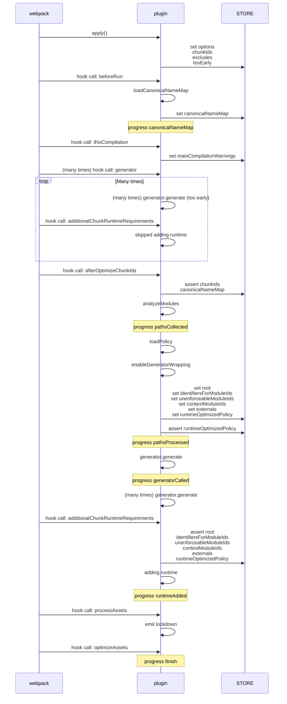

```mermaid
sequenceDiagram

webpack->>plugin: apply()
plugin->>STORE: set options<br> chunkIds<br> excludes<br> tooEarly
webpack->>plugin: hook call: beforeRun
plugin->>plugin: loadCanonicalNameMap
plugin->>STORE: set canonicalNameMap
Note over plugin: progress canonicalNameMap
webpack->>plugin: hook call: thisCompilation
plugin->>STORE: set mainCompilationWarnings
webpack->>plugin: (many times) hook call: generator
loop Many times
  plugin->>plugin: (many times) generator.generate (too early)
  webpack->>plugin: hook call: additionalChunkRuntimeRequirements
  plugin->>plugin: skipped adding runtime
end
webpack->>plugin: hook call: afterOptimizeChunkIds
plugin->>STORE: assert chunkIds<br>canonicalNameMap
plugin->>plugin: analyzeModules
Note over plugin: progress pathsCollected
plugin->>plugin: loadPolicy
plugin->>plugin: enableGeneratorWrapping
plugin->>STORE: set root<br> set identifiersForModuleIds<br> set unenforceableModuleIds<br> set contextModuleIds<br> set externals<br> set runtimeOptimizedPolicy
plugin->>STORE: assert runtimeOptimizedPolicy
Note over plugin: progress pathsProcessed
plugin->>plugin: generator.generate
Note over plugin: progress generatorCalled
plugin->>plugin: (many times) generator.generate
webpack->>plugin: hook call: additionalChunkRuntimeRequirements
plugin->>STORE: assert root<br>identifiersForModuleIds<br>unenforceableModuleIds<br>contextModuleIds<br>externals<br>runtimeOptimizedPolicy
plugin->>plugin: adding runtime
Note over plugin: progress runtimeAdded
webpack->>plugin: hook call: processAssets
plugin->>plugin: emit lockdown
webpack->>plugin: hook call: optimizeAssets
Note over plugin: progress finish
```
